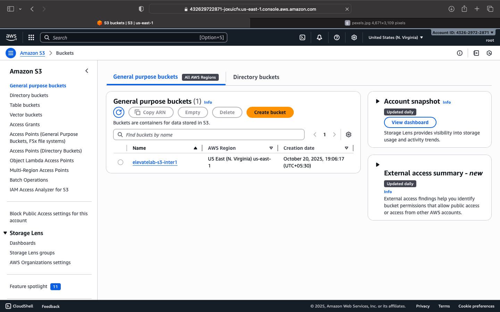

# AWS S3 Cloud Storage Project — ElevateLab Internship

## 📘 Project Overview
This project demonstrates creating an **Amazon S3 bucket**, uploading files, and managing public access.  
It is part of the **ElevateLab Cloud Internship** and showcases practical cloud storage skills in AWS.  
By completing this project, I gained hands-on experience with cloud storage, bucket policies, and file accessibility.

---

## 🧭 Objective
- Learn cloud object storage basics  
- Create and configure an S3 bucket  
- Upload files and make them publicly accessible  
- Understand bucket permissions and policies  

---

## 🪜 Step-by-Step Implementation

### **Step 1: Create an AWS S3 Bucket**
- Signed in to AWS Management Console  
- Opened **S3** service → Click **Create bucket**  
- Bucket name: `elevatelab-s3-inter1` (globally unique)  
- Region: `us-east-1`  
- Default permissions were kept safe initially  

**Screenshot:**  


---

### **Step 2: Upload File to the Bucket**
- Opened the bucket → Click **Upload → Add files**  
- Selected file: `istockphoto-2149530993-612x612.jpg`  
- Clicked **Upload**  
- File appeared under **Objects** tab  

**Screenshot:**  


---

### **Step 3: Configure Public Access**
#### **A. Disable Block Public Access**
- Go to **Permissions → Block Public Access → Edit**  
- Unchecked:
  - Block all public access  
  - Block new public bucket policies  
- Saved changes ✅  

#### **B. Add Bucket Policy**
- Allowed public read access for all objects with policy:  
```json
{
  "Version": "2012-10-17",
  "Statement": [
    {
      "Sid": "PublicReadGetObject",
      "Effect": "Allow",
      "Principal": "*",
      "Action": "s3:GetObject",
      "Resource": "arn:aws:s3:::elevatelab-s3-inter1/*"
    }
  ]
}
